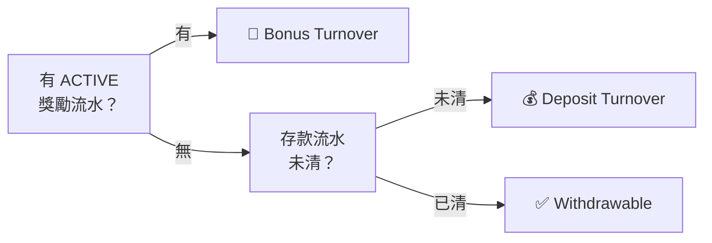
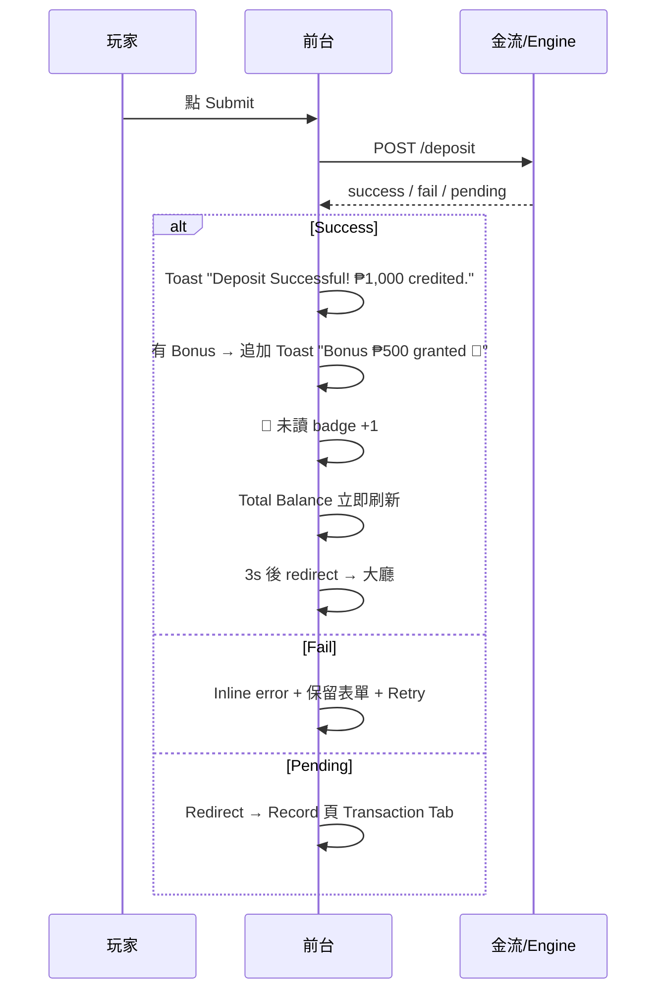

# 前台-玩家端 (Frontend) PRD

**對象：** 菲律賓（PH）玩家，前台語言：英文（口語化）
**範圍：** 儲值 / 流水 / 促銷相關的玩家端頁面
**對應後端：** 《流水引擎 PRD》、《活動設定管理 PRD》、《獎勵紀錄總表 PRD》

## 版本紀錄

| 版本 | 日期 | 修改人 | 修改內容 |
| --- | --- | --- | --- |
| V1.0 | 2026-04-17 | Design Agent | 初版；整合 Gap Analysis 決策 D37~D59 |

---

## 0. 全域規則（共用規則）

### 0.1 「一個進度條」原則

玩家在任何時刻**只看到一個**流水狀態元件 `<TurnoverStatus>`（對應 Turnover PRD §10.1）。優先序：



`<TurnoverStatus>` 出現於 **5 處**，為共用元件，資料同一個 API：
Deposit 頁、Withdraw 頁、Reward Center、🎁 Gift Box Dropdown、Wallet/Profile。

> **RD 開發提醒**：不允許各頁自行實作，否則狀態不一致。

### 0.2 玩家友善的狀態翻譯

| 後端 State | 前台顯示 | Badge 色 |
| --- | --- | --- |
| `PENDING` | `Pending` | Grey |
| `ACTIVE` | `Active` | Primary Blue |
| `COMPLETED` | `Completed 🎉` | Green |
| `OUT_OF_BALANCE` | `Ended (low balance)` | Yellow |
| `CANCELLED` | `Cancelled` | Orange |

### 0.3 術語與文案規則

| 後端 / PRD 術語 | 前台顯示 | 備註 |
| --- | --- | --- |
| Total Balance | `Total Balance` | 保留原詞 |
| Withdrawable | `Withdrawable` | |
| Deposit Turnover Target | `Deposit Turnover` | |
| Bonus Turnover Target | `Bonus Turnover` | 首次出現附 tooltip：`The total amount you need to bet before you can withdraw.` |
| Remaining Turnover | `Bet ₱X,XXX more to withdraw` | **絕對金額優先**，% 輔助 |
| BonusTurnoverMultiplier | 不顯示倍數字串 | 只顯示最終絕對金額 |

### 0.4 Help 入口

| 位置 | 入口 |
| --- | --- |
| **每個活動卡** | `View T&C` 連結，點擊開 Modal 顯示 Detailed T&C |
| **每頁 Footer** | 統一放 `FAQ` + `Need help? Contact Support` |

### 0.5 空狀態

所有「無資料」區塊**必須**放：友善 emoji / 一行文案 / 一個 CTA。**禁止留空白。**

---

## 1. Deposit 頁

### 1.1 用途

玩家儲值 + 可選參加促銷。**V1 活動成立的唯一途徑**（Turnover PRD §1 #5）。

### 1.2 入口

Header / Sidebar / Mobile Bottom Nav `Deposit`；Reward Center 卡片 `Deposit to Join`（自動 preselect 該活動）；Withdraw 阻擋卡 `Play Now`。

### 1.3 頁面結構

```
§1 Amount            快速金額 chips + 輸入框
§2 Payment Method    V1 固定 Epay 單卡
§3 Promotion         No Promotion（預設選中）+ Eligible 活動卡
§4 Summary           動態試算（選中活動後展開）
§5 Submit CTA        Deposit Now / Deposit & Join Promotion
Footer               FAQ / Contact Support
```

> 頁面頂部若玩家有 ACTIVE / 存款流水未清，顯示 `<TurnoverStatus>` 共用元件。

### 1.4 §1 Amount

| 元件 | 規格 |
| --- | --- |
| 快速金額 chips | `₱500` `₱1,000` `₱2,000` `₱5,000` `₱10,000`（橫向 5 顆） |
| 金額輸入 | Numeric keyboard，僅整數，`₱` prefix |

**驗證 — 即時隨輸入顯示紅字**（不等 blur、不等 submit）：

| 條件 | 紅字文案 |
| --- | --- |
| 金額 < 平台 MinDeposit | `Minimum deposit: ₱XXX` |
| 金額 > 平台 MaxDeposit | `Maximum deposit: ₱XXX` |
| 選了活動，金額 < 活動 Min | `Min ₱XXX for this promotion` |
| 選了活動，金額 > 活動 Max | `Max ₱XXX for this promotion` |

> Submit 按鈕：任一驗證失敗 → disable；全通過 → enable。

### 1.5 §2 Payment Method

V1 固定顯示 Epay 單卡，預設選中。V2+ 多卡且活動限制支付時其他卡 disable。

### 1.6 §3 Promotion

**只列 Eligible 活動**（不符合條件者不顯示），排序：

| 順位 | 類型 | 規則 |
| --- | --- | --- |
| 1 | `No Promotion` 卡 | **永遠置頂、預設選中** |
| 2+ | Eligible 活動卡 | 按後台建立時間 DESC |

**卡片元素：**

| 元素 | No Promotion 卡 | Eligible 卡 |
| --- | --- | --- |
| Icon | 🚫 | 活動 Card Icon |
| Tag | — | Promotion Tag（角標） |
| 主標 | `No Promotion` | 活動 Main Title |
| 副標 | `Deposit with no lock. Withdraw anytime.` | 活動 Subtext |
| T&C | — | `View T&C` 連結（每張卡上） |

**PENDING 警示**：玩家已有 `ACTIVE` 時選另一活動，卡下方顯示
`ℹ️ You already have an active promotion. This one will start after your current one ends.`

### 1.7 §4 Summary（試算）

**No Promotion：**
```
Deposit: ₱1,000.00
Credited to Total Balance: ₱1,000.00
```

**選中 Eligible 活動後：**

| 列 | 顯示 | 備註 |
| --- | --- | --- |
| Deposit | `₱1,000.00` | |
| Bonus | `+ ₱500.00` | 依 Bonus Value Type 計算 |
| Credited to Total Balance | `₱1,500.00` | |
| **Bet to withdraw** | **`₱45,000`** | Turnover PRD §5.6 公式算出，**絕對金額** |
| 🔒 Lock warning | `Withdrawal will be locked until you complete the bet requirement.` | 固定文案 |

> 不顯示 model name（A/B/C）與倍數字串。Turnover 首次出現附 tooltip。

### 1.8 §5 Submit CTA

| 狀態 | 文案 |
| --- | --- |
| Disabled | `Deposit Now`（灰） |
| Enabled - No Promotion | `Deposit Now` |
| Enabled - 有活動 | `Deposit & Join Promotion` |
| Loading | Spinner + `Processing...` |

### 1.9 Submit 後



### 1.10 OOB 後首次儲值

若玩家前一個 ACTIVE 剛因 Bustout Reset 結束：頁面頂部一張 info banner
`Welcome back! Your previous promotion ended due to low balance. Deposit now to continue.`（可 `✕` 關閉，該 session 不再顯示。）

---

## 2. Withdraw 頁

### 2.1 用途

玩家提款。需同時滿足：存款流水已清 + 無 ACTIVE 獎勵流水 + KYC/AML/Risk 通過（Turnover PRD §8）。

### 2.2 入口

Header / Sidebar / Mobile Bottom Nav `Withdraw`。

### 2.3 頁面結構

```
頂部 Wallet Card    Total Balance + Withdrawable + <TurnoverStatus>
§1 Amount           快速金額 + 輸入框
§2 Status Card      阻擋狀態卡 OR 可提款狀態
§3 Submit CTA
Footer              FAQ / Contact Support
```

### 2.4 §1 Amount

| 元件 | 規格 |
| --- | --- |
| 快速金額 chips | `25%` `50%` `75%` `MAX`（以 Withdrawable 計算） |
| 金額輸入 | Numeric keyboard，兩位小數，`₱` prefix |

**即時驗證（隨輸入紅字）：**

| 條件 | 文案 |
| --- | --- |
| 金額 < 平台 MinWithdrawalAmount | `Minimum withdrawal: ₱XXX` |
| 金額 > Withdrawable | `Exceeds your withdrawable amount` |

### 2.5 §2 Status Card（阻擋 / 可提款卡）

**檢查優先序（由上至下，只顯示最優先的那張）：**

| # | 狀態 | 條件 | 卡片內容 | 主 CTA |
| --- | --- | --- | --- | --- |
| 1 | KYC 未完成 | KYC ≠ passed | `⚠️ Complete KYC to withdraw` + 說明 | `Start KYC →` |
| 2 | 有 ACTIVE 獎勵流水 | 存在 ACTIVE 實例 | `🎰 Bonus Turnover in progress`<br>進度條 + `Bet ₱13,200 more to withdraw` | `Play Now →` |
| 3 | 存款流水未清 | DepositTurnoverProgress < Target | `💰 Deposit Turnover`<br>進度條 + `Bet ₱200 more to withdraw` | `Play Now →` |
| 4 | 可提款 | 以上皆通過 | `✅ Ready to withdraw` + `Withdrawable: ₱X,XXX.XX` | — |

> 阻擋狀態（#1~#3）下，**主 CTA 改為 `Play Now →` / `Start KYC →`**（引導下一步），Withdraw 按鈕變灰色 `Locked`。

### 2.6 §3 Submit CTA

| 狀態 | 文案 |
| --- | --- |
| Disabled（阻擋 or 驗證失敗） | `Locked`（灰） |
| Enabled | `Withdraw Now` |
| Loading | Spinner + `Processing...` |

### 2.7 Submit 後

| 結果 | 行為 |
| --- | --- |
| Success | Toast `Withdrawal requested. ₱X,XXX will be processed shortly.` → redirect Record 頁 Transaction Tab |
| Fail | Inline error + 保留金額 + Retry |

> 成功後引擎歸零存款流水（Turnover PRD §4.6）。

### 2.8 空狀態

| 情境 | 顯示 |
| --- | --- |
| Total Balance = 0 | `💸 You have no funds to withdraw.` + `Make a Deposit →` CTA |

---

## 3. Gift Box Dropdown

> **視覺 / 結構參考：** Rainbet Rewards dropdown（list 式分類，活動同時多類型並存）。我們以 UAT 藍色系實作。

### 3.1 位置與觸發

Header 右上角 🎁 icon 按鈕（對齊 `🔔 Notification`）。點擊展開 dropdown panel（Desktop）或 full-screen sheet（Mobile）。

### 3.2 未讀 Badge

| 觸發事件 | 說明 |
| --- | --- |
| 新活動上架 | 後台 Enabled 新活動 |
| Bonus 入帳 | 玩家活動實例建立後 Bonus 入帳 |
| ACTIVE 結束 | COMPLETED / OUT_OF_BALANCE / CANCELLED |
| 活動即將到期 | 玩家已參加但尚未完成，且活動 end_time < 48h |

> 顯示為角標數字（例如 `3`）；打開 dropdown 即視為「已讀」並清零。

### 3.3 結構（V1 範圍 + V2 擴充位）

```
┌──────────────────────────────────────┐
│ 🎁 Rewards                      [✕]   │  Header
├──────────────────────────────────────┤
│ [Featured Banner]                     │  （可選）營運配置
├──────────────────────────────────────┤
│ <TurnoverStatus> 共用元件              │  當前進度（§0.1）
├──────────────────────────────────────┤
│ § Active Promotion    （若有）         │  V1：玩家進行中活動
│   🎰 First Deposit · 75%        ›    │
├──────────────────────────────────────┤
│ § For You             （若有）         │  V1：Eligible 儲值促銷
│   🎁 Reload Bonus      Join Now  ›   │
│   🎁 Weekly Cashback   Join Now  ›   │
├──────────────────────────────────────┤
│ § Claim Now           ⏳ V2 預留       │  (Daily / Weekly / Monthly Bonus)
│ § VIP Rewards         ⏳ V2 預留       │  (Tier progress / Rank reward)
│ § Rakeback            ⏳ V2 預留       │
├──────────────────────────────────────┤
│              [All Rewards →]          │  到 Reward Center
└──────────────────────────────────────┘
```

**Section 顯示規則：** 無資料的 Section **整段隱藏**（包含標題），不留空列。

### 3.4 §1 Featured Banner（可選）

營運後台配置（V1 可 hardcode 一張，V2 做後台編輯器）。點擊 deep link 到 Reward Center 該活動卡 / 外部頁面。

### 3.5 §2 Current Status — `<TurnoverStatus>` 共用元件

顯示最強約束（§0.1）。若為 `🎰 Bonus Turnover` 或 `💰 Deposit Turnover`，附 `Bet ₱X,XXX more to withdraw` 副標。

### 3.6 §3 Active Promotion（V1 核心）

**顯示條件：** 玩家有 `ACTIVE` 或 `PENDING` 實例。

| 元件 | 內容 |
| --- | --- |
| Icon | 活動 Card Icon |
| Title | 活動 Main Title（單行省略） |
| Status 標籤 | ACTIVE：進度 `75%`（小進度條）<br>PENDING：`Pending · Starts after current` |
| 點擊 | 導向 Reward Center 該卡 Drawer |

> 多筆 PENDING 按 FIFO 排列在 ACTIVE 下方，最多顯示 3 筆，其餘 `+N more` 摺疊。

### 3.7 §4 For You（V1 核心）

**顯示條件：** 存在 Eligible 儲值促銷活動。

| 元件 | 內容 |
| --- | --- |
| 顯示數量 | 最多 3 張 Eligible 活動 |
| 排序 | 後台 priority / 建立時間 DESC |
| Row 元素 | `[Icon] [Tag] Title  [Join Now →]` |
| 點擊 | 導向 Deposit 頁並 preselect 該活動（D50） |

### 3.8 §5 Claim Now / VIP / Rakeback（V2 預留）

V1 不實作。PRD 明列保留位置，避免 V2 擴充時整個 layout 重排。

### 3.9 `All Rewards →`

底部主按鈕，導向 Reward Center。

### 3.10 空狀態

| 情境 | Dropdown 內容 |
| --- | --- |
| 無 Active + 無 Eligible + 可提款 | 只顯示 `<TurnoverStatus>` + `✅ You're all set. Total Balance is fully withdrawable.` + `Withdraw →` |
| 無 Active + 無 Eligible + Balance = 0 | 只顯示 `🎁 No rewards right now.` + `Deposit →` |

---

## 4. Reward Center

> **視覺 / 結構參考：** Rainbet Rewards 頁（Banner 輪播 + 分類 Section + V2 擴充位）。視覺用 UAT 藍色系。

### 4.1 用途

集中展示玩家所有獎勵機會 + 當前參加狀態。V1 僅「儲值促銷」類別，layout 保留 V2 擴充區。

### 4.2 入口

Top Nav `Promo` / Sidebar `🎁 Promotions` / Gift Box `All Rewards →` / Mobile Bottom Nav `Rewards` / 行銷 banner deep link。

### 4.3 頁面結構（V1 範圍 + V2 擴充位）

```
Page Header: Rewards + Breadcrumb

§1 Featured Banner 輪播         營運配置（可選）

§2 Your Active Promotion       V1：玩家當前 ACTIVE / PENDING 醒目置頂
    - ACTIVE 大卡（進度條 + Bet ₱X more + Play Now）
    - PENDING 小卡（Starts after current）

§3 Deposit Promotions          V1 核心：Eligible 儲值促銷活動
    分類標題 + Card Grid

§4 Claim Now                   ⏳ V2 預留（Daily / Weekly / Monthly）
§5 VIP Tier Progress           ⏳ V2 預留
§6 Rakeback                    ⏳ V2 預留
§7 Total Rewards Summary       ⏳ V2 預留（累計已領）

Footer: FAQ / Contact Support
```

**Section 顯示規則：** 無資料的 Section 整段隱藏。

### 4.4 §1 Featured Banner 輪播

| 元件 | 規格 |
| --- | --- |
| 位置 | 頁面頂部 |
| 尺寸 | 1560×600（Desktop）/ 比例縮放（Mobile） |
| 數量 | 1~5 張，營運後台配置 |
| 互動 | Auto-rotate 每 5 秒；左右箭頭 + 底部 dots；點擊 deep link 該活動 |

### 4.5 §2 Your Active Promotion

**顯示條件：** 玩家有 `ACTIVE` 或 `PENDING` 實例。

**ACTIVE 卡片（大卡，醒目主色邊框）：**

| 元素 | 內容 |
| --- | --- |
| Banner | 活動 Banner 圖 |
| Tag + Title | 活動角標 + Main Title |
| 進度條 | `Bonus Turnover` 進度 + 百分比 |
| 主文案 | `Bet ₱13,200 more to withdraw` |
| 副文案 | `Principal ₱1,000 + Bonus ₱500` |
| 主 CTA | `Play Now →` |
| 次連結 | `View T&C` |

**PENDING 卡片（小卡，灰階）：**

| 元素 | 內容 |
| --- | --- |
| Tag + Title | 活動角標 + Main Title |
| 狀態 | `Pending · Starts after your current promotion ends` |
| 次連結 | `View T&C` |

> 多筆 PENDING 依 FIFO 排列（Turnover PRD §7）。

### 4.6 §3 Deposit Promotions（V1 核心）

**列表規則：**

| 項目 | 規則 |
| --- | --- |
| 範圍 | 僅顯示 Eligible 活動（Ineligible 不顯示，D38） |
| 排序 | 後台建立時間 DESC（可由後台 priority 覆寫） |
| Layout | Mobile 單欄 / Tablet 單欄 / Desktop 雙欄 |
| 分類標題 | `Deposit Promotions` + 活動數 badge（例 `3`） |

**卡片元素：**

| 元素 | 內容 | 來源 |
| --- | --- | --- |
| Banner | 活動 Banner 圖 | Promo §Step 4 |
| Tag | 角標 `FIRST DEPOSIT` / `RELOAD` 等 | Promotion Tag |
| Main Title | 活動名稱 | Main Title |
| Subtext | 副標摘要 | Subtext / Summary |
| Period | `Apr 10 ~ Apr 30`（無結束 `Till further notice`） | Start/End Time |
| CTA 1 | `View T&C`（文字連結，開 Modal） | Detailed T&C |
| CTA 2 | `Deposit to Join`（主按鈕） | → Deposit 頁 preselect（D50） |

### 4.7 §4~§7 V2 擴充保留位

V1 不實作。PRD 明列以確保 RD 設計元件 API 時預留空間（例如 Section 組件要支援 `type` prop、Card 要支援不同 CTA pattern）。

| Section | 未來內容 | 主要差異（相對 Deposit Promotions） |
| --- | --- | --- |
| Claim Now | 系統自動發放的 Daily / Weekly / Monthly Bonus | CTA = `Claim`；有倒數計時（`In 23h` / `5d`） |
| VIP Tier Progress | 等級進度條 + 可領等級獎勵 | 無 CTA 卡片，改為進度列 + 等級 icon 階梯 |
| Rakeback | 依損失返現 | CTA = `Claim ₱XXX`；無 `Join` 動作 |
| Total Rewards Summary | 各類累計已領金額 | 純展示，Footer 橫列 |

### 4.8 空狀態

| 情境 | 顯示 |
| --- | --- |
| 無 Active + 無 Eligible | `🎯 No promotions available right now. Check back soon!` + `Make a Deposit →` |

---

## 5. Record 頁 — Promotion Tab

> **範圍限定：** Record 頁其他 Tab（Transaction / Game）由現有平台提供，**本 PRD 僅新增 Promotion Tab**。

### 5.1 用途

玩家查詢自己參加過的促銷活動紀錄與進度。

### 5.2 入口

Record 頁新增 Tab（Tab 名：`Promotion`）；從 Reward Center `Your Active Promotion` 卡右上 `View History` 連結可跳至此 Tab。

### 5.3 Tab 結構

```
[篩選列]  Status / 日期範圍
[Table / Card List]
[Pagination]  每頁 20
```

### 5.4 欄位

| 欄位 | 顯示 | 備註 |
| --- | --- | --- |
| Promotion | 活動 Main Title | 點擊整列展開 Drawer |
| Joined | `MMM DD, YYYY HH:mm` | UTC+8 |
| Principal + Bonus | `₱1,000 + ₱500` | |
| Bonus Turnover | 進度條 OR `₱13,200 / ₱45,000 ✅` | ACTIVE 時即時推進；終態顯示最終值 |
| Status | 狀態翻譯（§0.2） | Badge 色 |

### 5.5 排序 / 篩選

| 項目 | 規則 |
| --- | --- |
| 排序 | `ACTIVE` 置頂 → `PENDING` → 其他按 Joined DESC（D51） |
| Status 篩選 | `All` / `Active` / `Pending` / `Completed` / `Ended` / `Cancelled` |
| 日期範圍 | `7 days` / `30 days` / `All time` / `Custom` |

### 5.6 Drawer（點擊整列展開）

| 區塊 | 內容 |
| --- | --- |
| 活動資訊 | Banner / Tag / Title / Subtext |
| T&C Snapshot | 參加當下的 Detailed T&C 版本 |
| 計算明細 | Principal / Bonus / Bonus Turnover Target / Progress / Model 公式說明（口語化） |
| 時間戳 | Created At / Bonus Granted At / Ended At（若終態） |

### 5.7 空狀態

| 情境 | 顯示 |
| --- | --- |
| 無紀錄 | `🎁 You haven't joined any promotions yet.` + `Browse Rewards →` |
| 篩選無結果 | `No records found for this filter.` + `Clear Filters` |

---

## 附錄 A：Gap Analysis 決策對照（D37~D60）

| 決策 | 說明 | 影響章節 |
| --- | --- | --- |
| D37 | `MinWithdrawalAmount` 加入 Config | §2 |
| D38 | Ineligible 活動**不顯示** | §1.6 |
| D39 | 遊戲入口警告觸發點明定 | Game Lobby |
| D40 | 🎁 未讀 badge 觸發事件 | §3 |
| D41 | OOB 後玩家端 banner / Toast V1 必做 | §1.10 |
| D42 | Bonus / Turnover 絕對金額試算 | §1.7 |
| D43 | PENDING 活動玩家端可見 | §1.6 / §3 / §4 |
| D44 | Deposit 成功後導向大廳 + Toast | §1.9 |
| D45 | KYC 前置驗證 | §2 |
| D46 | `No Promotion` 第一選項 | §1.6 |
| D47 | 選活動後 🔒 Lock Warning | §1.7 |
| D48 | 阻擋提款顯示絕對金額 | §2 |
| D49 | 阻擋狀態主 CTA 轉向 `Play Now` | §2 |
| D50 | 活動卡直接 `Deposit to Join` preselect | §3 / §4 |
| D51 | Record Promotion Tab ACTIVE 置頂 | §5 |
| D52 | 玩家友善狀態翻譯 | §0.2 |
| D53 | 共用 `<TurnoverStatus>` 元件 | §0.1 |
| D54 | 每活動卡自帶 `View T&C` | §0.4 / §1.6 / §4.6 |
| D55 | Footer 統一 FAQ + Contact Support | §0.4 |
| D56 | 驗證即時紅字（不等 blur / submit） | §1.4 / §2.4 |
| D57 | Bonus Turnover 首次出現附 tooltip | §0.3 |
| D58 | Total Balance 保留原詞 | §0.3 |
| D59 | 空狀態規則：emoji + 一行 + CTA | §0.5 |
| **D60** | **Gift Box / Reward Center 採 Section 式分類（參考 Rainbet）**：`Active Promotion` + `For You` + V2 擴充保留位；無資料 Section 整段隱藏 | §3 / §4 |
| **D61** | **Record 頁僅新增 Promotion Tab**，Transaction / Game 由現有平台提供 | §5 |
