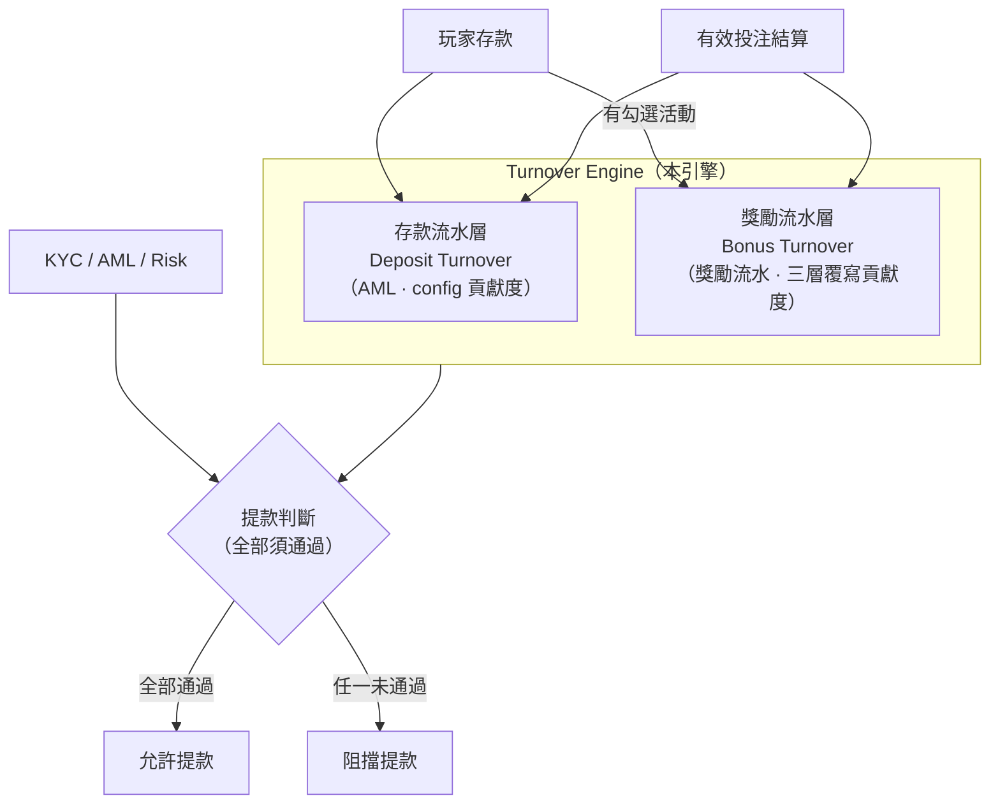
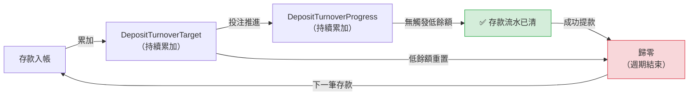
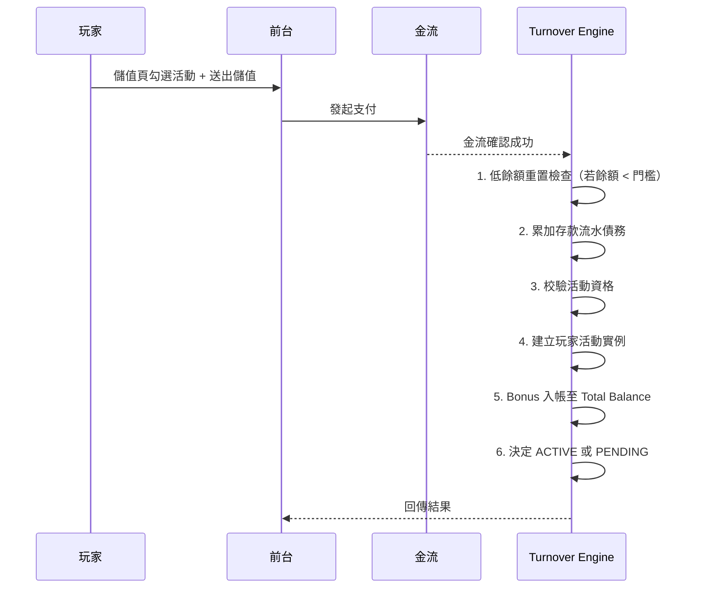
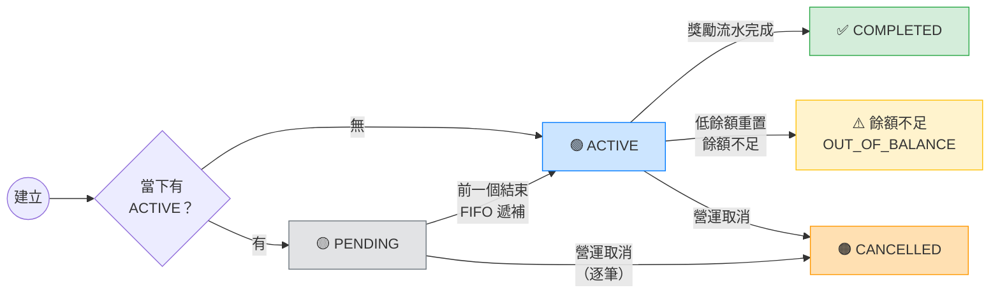
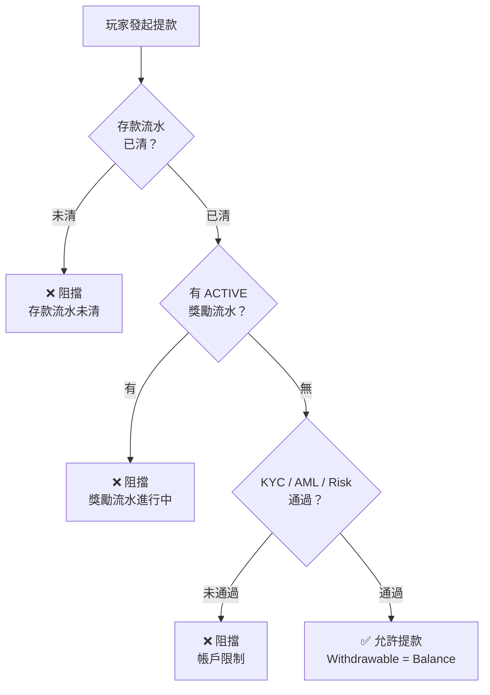
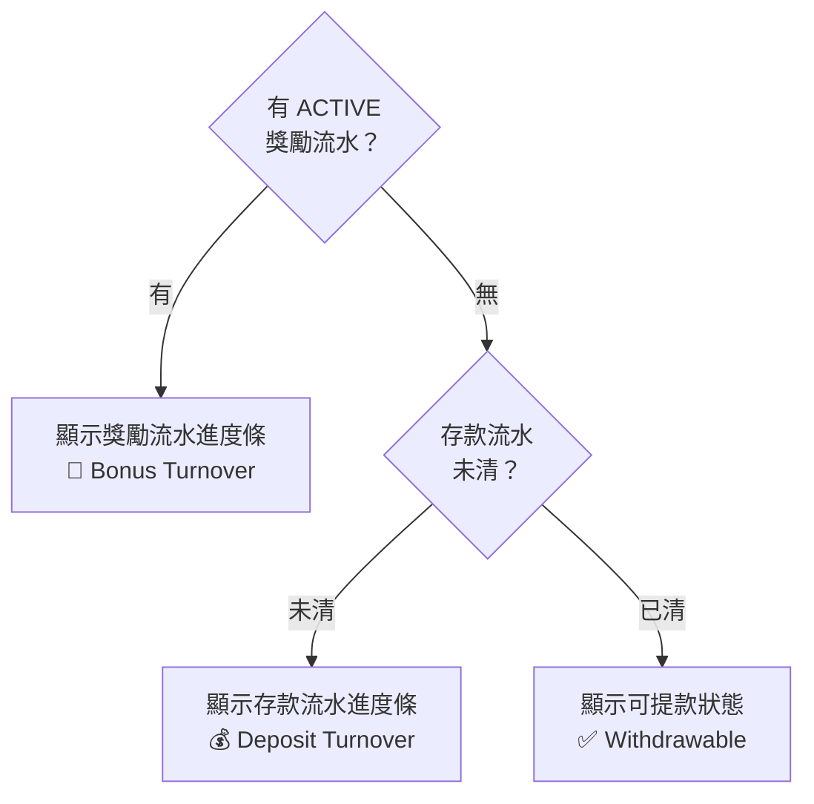

# 流水引擎（Turnover Engine）PRD

## 版本紀錄

| 版本 | 日期 | 修改人 | 修改內容 |
| --- | --- | --- | --- |
| V1.0 | 2025/08 | AC | 初版建立（原[金流流水管理](https://docs.google.com/document/d/1nV1TZTjs-6cVOZR4WPhfwpNm0bllU_ErB_9bSRkzGDQ/edit?tab=t.0#heading=h.67poqrgxhtk)PRD） |
| V1.1 | 2026/04 | Clem | 將基礎AML流水機制與促銷活動流水合併成一個計算引擎，供平台需要WR計算的功能使用 |

---

## 1. 固定原則

| # | 原則 | 說明 |
| --- | --- | --- |
| 1 | **多錢包架構** | 本引擎的存款流水規則**可套用於任一錢包**。**促銷活動功能 V1 僅於線上錢包啟用。** |
| 2 | **單一資金** | 同一錢包內，玩家只有一個 Total Balance。 |
| 3 | **不分子錢包** | 不建立 Bonus Wallet 或 Promotion Wallet。所有資金直接體現在 Total Balance。 |
| 4 | **雙層共存** | 存款流水（AML）與獎勵流水（Bonus Turnover）同時存在。
**每筆存款永遠產生存款流水**，無論是否同時參加活動。同一筆有效投注同時餵給兩層。 |
| 5 | **玩家主動參加** | V1 活動成立方式固定為儲值頁主動勾選 + 儲值成功。 |
| 6 | **單一 ACTIVE** | 同一時間只允許一個 ACTIVE 獎勵流水 實例。 |
| 7 | **PENDING 排隊** | 其他獎勵流水 進入 PENDING，依建立時間 FIFO 遞補。 |
| 8 | **PENDING bonus 立即入帳** | Bonus 在建立當下即入帳，可在前一個 ACTIVE 期間先被使用。 |
| 9 | **提款須全部通過** | 提款需同時滿足：存款流水已清 + 無 ACTIVE 獎勵流水 + KYC/AML/Risk。 |
| 10 | **ACTIVE 全鎖提款** | 存在 ACTIVE 獎勵流水 時，提款全面封鎖。 |
| 11 | **CANCELLED 不動餘額** | 營運取消活動時，結束所有活動但**不動 Total Balance、不自動扣回 Bonus**。後續由營運手動處理。 |
| 12 | **終態不可逆** | COMPLETED / OUT_OF_BALANCE / CANCELLED 不可重啟。 |

---

## 2. 名詞對照表（Glossary）

> 玩家面向用語以菲律賓 iGaming 市場慣用英文為基準。後台/內部用語以 RD 溝通準確為優先。
> 

### 2.1 存款流水（Deposit Turnover）

| 前台顯示（EN） | 中文 | 英文欄位名 | 定義 |
| --- | --- | --- | --- |
| Deposit Turnover | 存款流水目標 | DepositTurnoverTarget | 所有存款累加的流水目標總額 |
| Turnover Progress | 存款流水進度 | DepositTurnoverProgress | 自上次重置後累積的有效投注額 |
| Remaining Turnover | 存款剩餘流水 | DepositTurnoverRemaining | `MAX(DepositTurnoverTarget - DepositTurnoverProgress, 0)` |
| —（後台參數） | 存款流水倍數 | DepositTurnoverMultiplier | 平台 config 設定，預設 `1x` |
| —（後台參數） | 返場門檻 | ComebackThreshold | 平台 config 設定，預設 `₱1` |

### 2.2 獎勵流水（Bonus Turnover）

| 前台顯示（EN） | 中文 | 英文欄位名 | 定義 |
| --- | --- | --- | --- |
| — | 活動設定 | Promotion Event | 後台建立的活動主檔 |
| — | 玩家活動實例 | Player Promotion Instance | 玩家成功參加後建立的獨立紀錄 |
| — | 本金金額 | Principal Amount | 獎勵流水計算用的本金（V1 = 合格儲值金額） |
| Bonus | 紅利金額 | Bonus Amount | 活動發放的 bonus |
| Bonus Turnover | 獎勵流水目標 | BonusTurnoverTarget | 建立時固定，不因後續儲值改變 |
| Bonus Turnover Progress | 獎勵流水進度 | BonusTurnoverProgress | 目前已累積的有效流水（僅系統結算推進，不可手動修改） |
| Valid Turnover | 有效投注金額 | Settled Valid Turnover | 已結算且通過 §6 全部條件的投注金額，為流水推進的唯一口徑 |

### 2.3 共用

| 前台顯示（EN） | 中文 | 英文欄位名 | 定義 |
| --- | --- | --- | --- |
| Total Balance | 餘額 | Total Balance | 玩家當前錢包中的總金額 |
| Withdrawable | 可提款餘額 | Available Balance | 兩層皆清時 = Total Balance，否則 = 0 |
| — | 低餘額重置 | Bustout Reset | 餘額低於門檻時，清空存款流水 + ACTIVE 獎勵流水轉為餘額不足 |

### 2.4 玩家友善的狀態翻譯（D52）

後端 State 與前台顯示文案對照：

| 後端 State | 前台顯示 | Badge 色系 |
| --- | --- | --- |
| `PENDING` | `Pending` | Grey |
| `ACTIVE` | `Active` | Primary Blue |
| `COMPLETED` | `Completed 🎉` | Green |
| `OUT_OF_BALANCE` | `Ended (low balance)` | Yellow |
| `CANCELLED` | `Cancelled` | Orange |

> 前台顯示詳見《前台-玩家端 (Frontend) PRD》§0.2。

---

## 3. 系統架構總覽



> 每筆存款永遠產生存款流水。同一筆有效投注同時餵給兩層，各自使用不同貢獻度計算。
> 

---

## 4. 存款流水規則

### 4.1 DepositTurnoverTarget 生命週期



**存款流水 vs 獎勵流水 的生命週期差異：**

|  | 存款流水 DepositTurnoverTarget | 獎勵流水 BonusTurnoverTarget |
| --- | --- | --- |
| 產生 | 每筆存款累加 | 建立實例時一次算定 |
| 推進 | DepositTurnoverProgress 每筆投注累加 | BonusTurnoverProgress 每筆投注累加 |
| 結束方式 | **歸零**（低餘額重置或成功提款） | **終態**（COMPLETED / 餘額不足 / CANCELLED） |
| 生命週期 | 跨多筆存款持續存在，直到歸零事件 | 單一 instance，從建立到終態即結束 |
| 歸零後 | 下一筆存款重新累加 | 新的活動建立新 instance |

### 4.2 債務產生

```
存款流水目標(新) = 存款流水目標(舊) + (存款金額 × DepositTurnoverMultiplier)
```

| 操作 | 是否產生存款流水 |
| --- | --- |
| 玩家存款（無論是否同時參加活動） | ✅ |
| 後台補單（成功） | ✅ |
| 獎勵 Bonus 入帳 | ❌ |
| Manual Adjustment（返還/補償） | ❌ |

### 4.3 債務償還

每筆有效投注結算時，系統計算該注對存款流水的貢獻並累加：

```
本次貢獻 = 有效投注金額 × 存款貢獻度
存款流水進度(新) = 存款流水進度(舊) + 本次貢獻
```

當 `DepositTurnoverProgress >= DepositTurnoverTarget` 時，存款流水視為已清。

### 4.4 存款貢獻度（Config 參數化）

由平台 config 設定檔管理（**非後台 UI**），包含兩部分：

**Category 貢獻度表**（每個 Category 可調整百分比）：

| Category | 預設貢獻度 | 說明 |
| --- | --- | --- |
| SLOT | 100% | 老虎機 |
| FISH | 100% | 捕魚機 |
| TABLE | 10% | 牌桌遊戲 |
| ARCADE | 100% | 街機類 |
| EGAME | 100% | 電子遊戲 |
| LIVE | 10% | 真人荷官 |

**遊戲排除清單**（指定 Game Code，命中者存款貢獻度 = 0%）：

| 欄位 | 說明 |
| --- | --- |
| Game Code | 遊戲唯一識別碼 |
| 排除原因 | 例如：PvP 遊戲 |

> 被排除的遊戲，玩家仍可進入遊玩，但投注不計入存款流水。
> 
> 
> **設計依據**：存款流水的 AML 定位只需確認「資金有被真實投入遊戲」，不應因遊戲選擇而懲罰玩家。雙邊押注等行為偵測由 Risk/Fraud 系統另行處理。
> 

### 4.5 低餘額重置（Bustout Reset）

| 項目 | 定義 |
| --- | --- |
| **觸發條件** | `Total Balance < ComebackThreshold` 且 `無未結算注單`（同時滿足） |
| **觸發時機** | (1) 每筆注單結算後檢查；(2) 每筆存款入帳前檢查 |
| **存款流水效果** | DepositTurnoverTarget 與 DepositTurnoverProgress 歸零 |
| **獎勵流水效果** | 若有 ACTIVE 獎勵流水 → 轉為餘額不足 OUT_OF_BALANCE（終態） |
| **與獎勵流水的關係** | 低餘額重置是餘額不足（OUT_OF_BALANCE）的唯一觸發來源 |

### 4.6 存款流水歸零事件

歸零觸發**僅有 2 個**，保持系統最簡：

| 事件 | 效果 | 定位 |
| --- | --- | --- |
| **低餘額重置** | DepositTurnoverTarget + DepositTurnoverProgress 歸零 + ACTIVE 獎勵流水轉餘額不足 | 玩家沒錢了，清場重來 |
| **成功提款**（不含後台手動提款） | DepositTurnoverTarget + DepositTurnoverProgress 歸零 | 週期結束，帳務整理 |

> **歸零不影響歷史紀錄**：僅重置進行中的計數器，所有歷史投注紀錄與 audit log 完整保留。
> 
> 
> **後台手動調整流水**：已實作，可用於 CANCELLED 後的流水調整。僅調整 DepositTurnoverTarget，DepositTurnoverProgress 不動。若調整後 Progress >= Target，則視為已清。
> **後台手動提款=adjustment=完全沒有判斷流水**
> 

---

## 5. 獎勵流水（Bonus Turnover）規則

### 5.1 活動設定（Promotion Event）

由後台建立的活動主檔，欄位定義見後台 PRD。管理狀態：`Enabled` / `Disabled`。

### 5.2 玩家活動實例（Player Promotion Instance）

| 欄位 | 說明 | 可變更？ |
| --- | --- | --- |
| Instance ID | 唯一識別碼 | ❌ |
| Promotion Event ID | 對應活動設定 | ❌ |
| Player ID | 玩家 | ❌ |
| Principal Amount | 本金（V1 = 合格儲值金額） | ❌ |
| Bonus Amount | 紅利金額 | ❌ |
| BonusTurnoverModel | A / B / C | ❌ |
| BonusTurnoverMultiplier | 獎勵流水倍數 | ❌ |
| BonusTurnoverTarget | 獎勵流水目標 | ❌ |
| BonusTurnoverProgress | 獎勵流水進度 | 僅系統結算推進，不可手動修改 |
| Current State | `PENDING / ACTIVE / COMPLETED / OUT_OF_BALANCE / CANCELLED` | ✅ |
| Exclude From Rebate | 是否排除反水計算 | ❌ |
| Created At | 建立時間 | ❌ |
| Bonus Granted At | Bonus 入帳時間 | ❌ |
| Ended At | 結束時間 | ✅ |
| Remark / 操作紀錄 |  | ✅ |

> **建立時鎖定原則**：Principal Amount、Bonus Amount、BonusTurnoverModel、BonusTurnoverMultiplier、BonusTurnoverTarget 均為建立當下固定，後續不因新增儲值或 Bonus 而改寫。
> 

### 5.3 玩家參加流程



**冪等保護**：同一觸發事件只能建立一筆實例、發放一次 Bonus。

**資格檢查**：

| 檢查項 | 規則 |
| --- | --- |
| 領取次數 | 玩家未達該活動 Max Claims Per User |
| 儲值金額 | `Min Deposit <= 金額 <= Max Deposit`（若有設定） |
| 支付方式 | 符合活動指定的 Eligible Payment Methods（若有限制） |
| 玩家範圍 | 符合 Player Scope（All / Include / Exclude / AB Test） |
| 活動狀態 | `status = Enabled` 且在活動有效期間內 |

> **前台表單驗證**：Min Deposit / Max Deposit 在前台輸入時即時檢查，不符合條件的金額**無法送出儲值**（Submit 按鈕 Disable）。後端須二次校驗。
> 

### 5.4 Bonus 入帳

| 情境 | Bonus 入帳 | 說明 |
| --- | --- | --- |
| 實例建立後直接成為 ACTIVE | 立即入帳 |  |
| 實例建立後進入 PENDING | 立即入帳 | PENDING bonus 可能在前一個 ACTIVE 期間先被使用/輸掉 |
| PENDING 轉 ACTIVE | 不再入帳 | Bonus 已在 PENDING 建立時入帳；獎勵流水進度從 0 開始 |

> **Bonus 入帳不產生存款流水。**
> 

### 5.5 單一錢包綁定（Sticky Bonus）

當存在 ACTIVE 活動時：

| 規則 | 說明 |
| --- | --- |
| 所有餘額受約束 | 玩家所有可下注餘額受 ACTIVE 活動規則約束 |
| 額外儲值也受約束 | 期間額外儲值資金一併受限，不可視為可獨立提款資金 |
| 額外儲值不改獎勵流水 | 不改變既有實例的 BonusTurnoverTarget / Principal Amount |

### 5.6 獎勵流水三種計算模型

活動實例建立時，系統根據模型計算 **BonusTurnoverTarget（獎勵流水目標）**：

| 模型 | BonusTurnoverTarget 公式 | 範例（Principal ₱1,000, Bonus ₱500, 30x） | 適用場景 |
| --- | --- | --- | --- |
| **A：本金 + 紅利** | `(Principal + Bonus) × Multiplier` | (1000+500)×30 = **₱45,000** | 首儲、高額回饋 |
| **B：僅本金** | `Principal × Multiplier` | 1000×30 = **₱30,000** | 只要求本金打碼 |
| **C：僅紅利** | `Bonus × Multiplier` | 500×30 = **₱15,000** | 無儲值送彩金、KYC bonus |

> BonusTurnoverTarget 在實例建立時一次算定，寫入 Player Promotion Instance，後續不再變動。
> 

### 5.7 獎勵流水推進

**有效投注必須同時滿足：**

| # | 條件 |
| --- | --- |
| 1 | 活動實例狀態為 ACTIVE |
| 2 | 注單已結算（Settled） |
| 3 | 屬於有效投注（見 §6） |
| 4 | 命中遊戲的獎勵貢獻度 > 0% |

**推進公式：**

每筆有效投注結算時，系統計算該注對獎勵流水 的貢獻並累加：

```
本次貢獻 = 有效投注金額 × 該遊戲獎勵貢獻度
獎勵流水進度(新) = 獎勵流水進度(舊) + 本次貢獻
```

當 `BonusTurnoverProgress >= BonusTurnoverTarget` → 立即切為 COMPLETED。

### 5.8 獎勵貢獻度（三層覆寫）

每個活動獨立設定，覆寫優先度：

| 優先度 | 層級 | 說明 |
| --- | --- | --- |
| 1（最高） | Game ID 覆寫 | 特定遊戲 |
| 2 | Provider 覆寫 | 特定供應商 |
| 3（最低） | Category Default | 類別預設（**必填**） |

Category 固定 6 類：`SLOT` / `FISH` / `TABLE` / `ARCADE` / `EGAME` / `LIVE`

每個 Category 都必須配置預設貢獻度。每個遊戲都必須映射到一個 Category。

---

## 6. 有效投注判定（統一定義）

存款流水與獎勵流水 **共用**以下判定規則：

| # | 條件 | 說明 |
| --- | --- | --- |
| 1 | 已結算（Settled） | 注單狀態為已結算 |
| 2 | 非和局 | Tie / Push 不計入 |
| 3 | 非無效/取消 | 被系統判定無效或取消的注單不計入 |
| 4 | 非排除遊戲 | 命中 config 排除清單（Game Code）的遊戲不計入 |

> 通過以上全部條件的投注金額 = **有效投注金額（Valid Turnover）**，為兩層流水推進的唯一口徑。
> 
> 
> **雙邊押注**（如百家樂同時押莊閒）屬行為層偵測，由 Risk/Fraud 系統處理，不在引擎職責內。
> 

---

## 7. 活動狀態機

### 7.1 狀態流轉圖



### 7.2 狀態定義

| 狀態 | 說明 | 獎勵流水累積 | 提款影響 | 終態 |
| --- | --- | --- | --- | --- |
| **PENDING** | 排隊等待遞補 | ❌ | 自身不鎖定 | ❌ |
| **ACTIVE** | 進行中，投注推進獎勵流水 | ✅ | **全面封鎖提款** | ❌ |
| **COMPLETED** | 獎勵流水達標完成 | — | 解除鎖定 | ✅ |
| **餘額不足（OUT_OF_BALANCE）** | 低餘額重置觸發 | — | 解除鎖定 | ✅ |
| **CANCELLED** | 營運手動取消 | — | 解除鎖定，餘額不動 | ✅ |

### 7.3 FIFO 遞補規則

ACTIVE 進入 COMPLETED 或 OUT_OF_BALANCE 後：
1. 系統檢查 PENDING 佇列
2. 將 Created At 最早的下一筆遞補為 ACTIVE
3. 若遞補後立即觸發低餘額重置（餘額仍 < 門檻），**同一輪連鎖判定**直到佇列清空或找到可運作的 ACTIVE

### 7.4 OUT_OF_BALANCE

| 項目 | 定義 |
| --- | --- |
| **觸發來源** | 僅由低餘額重置觸發（§4.5） |
| **餘額處理** | 剩餘微小餘額**不沒收**，保留於 Total Balance |
| **存款流水** | 同步歸零（低餘額重置的效果） |

### 7.5 CANCELLED 操作規則

營運在 Reward History 對 `ACTIVE` 或 `PENDING` 實例執行 Cancel（支援多選批次），每筆獨立處理，**不連帶影響同一玩家的其他獎勵流水**。

| 步驟 | 操作 |
| --- | --- |
| 1 | 將選取的實例（ACTIVE 或 PENDING）切為 CANCELLED |
| 2 | 若被取消的是 ACTIVE，引擎依 FIFO 佇列自動將下一筆 PENDING 遞補為 ACTIVE |
| 3 | 記錄：cancel_reason（Dropdown 選項）、remark、operator、action_time |

> **不清零 Total Balance、不自動扣回 Bonus**。若 Transaction 中任一步驟失敗，整筆操作回滾。
> 
> 
> **Audit Log**：必須記錄操作前的 Total Balance、各活動實例的狀態與 BonusTurnoverProgress。
> 

**CANCELLED 後處理（營運手動）：**

| 情境 | 營運操作 |
| --- | --- |
| 活動設錯，要退還玩家 | 無須額外動作（餘額未動，玩家可繼續玩或提款） |
| 需扣回 Bonus | 透過 Manual Adjustment 扣除 Bonus 金額 |
| 需調整存款流水 | 透過「手動調整流水」功能修正 DepositTurnoverTarget |
| 玩家作弊，需沒收餘額 | CANCELLED → Manual Adjustment 將餘額扣掉 |

---

## 8. 提款判斷

### 8.1 判斷流程



### 8.2 引擎回傳

| 條件 | 判斷邏輯 |
| --- | --- |
| 存款流水 | `DepositTurnoverProgress >= DepositTurnoverTarget` |
| 獎勵流水 | 無 ACTIVE 狀態的玩家活動實例 |

---

## 9. 雙層Turnover計算範例

### 9.1 正常路徑：儲值 + 首儲活動

> 初始狀態：全新週期，存款流水與獎勵流水均為零。
條件：DepositTurnoverMultiplier = 1x, 首儲活動 BonusTurnoverModel A, 30x, Bonus 50%
> 

| # | 事件 | 存款流水（目標 / 進度） | 獎勵流水（目標 / 進度） | 可提款？ |
| --- | --- | --- | --- | --- |
| 1 | 存款 ₱1,000 + 勾選首儲（Bonus ₱500） | ₱1,000 / ₱0 | ₱45,000 / ₱0 | ❌ |
| 2 | Slot 投注 ₱1,000（存款 100%, 獎勵 100%） | ₱1,000 / ₱1,000 ✅ | ₱45,000 / ₱1,000 | ❌ |
| 3 | 持續 Slot 投注累計 ₱45,000 | ₱1,000 / ₱45,000 ✅ | ₱45,000 / ₱45,000 → **COMPLETED** | ✅ |

> 存款流水 1x = ₱1,000，在獎勵流水 30x = ₱45,000 的打碼過程中早已順帶打滿。**玩家完全無感。**
> 

### 9.2 邊界：獎勵流水快完成時大額純儲值

> 初始狀態：接續某次存款後，存款流水已推進大半、獎勵流水接近達標。
> 

| # | 事件 | 存款流水（目標 / 進度） | 獎勵流水（目標 / 進度） | 可提款？ |
| --- | --- | --- | --- | --- |
| 1 | 初始狀態 | ₱1,000 / ₱950 | ₱30,000 / ₱29,950 | ❌ |
| 2 | 純儲值 ₱5,000（不參加活動） | ₱6,000 / ₱950 | ₱30,000 / ₱29,950 | ❌ |
| 3 | Slot ₱100 → 獎勵流水 COMPLETED | ₱6,000 / ₱1,050 | **COMPLETED** | ❌ |
| 4 | 繼續投注 ₱4,950 | ₱6,000 / ₱6,000 ✅ | — | ✅ |

> 獎勵流水結束後，存款流水債務接手提款管控。正確的 AML 行為。
> 

### 9.3 低餘額重置（Bustout Reset）觸發

> 初始狀態：全新週期。條件：ComebackThreshold = ₱1
> 

| # | 事件 | Total Balance | 存款流水（目標 / 進度） | 獎勵流水 |
| --- | --- | --- | --- | --- |
| 1 | 存款 ₱1,000 + 勾選活動 | ₱1,500 | ₱1,000 / ₱0 | ACTIVE |
| 2 | 遊玩後輸到剩 ₱0.5，注單全結算 | ₱0.5 | ₱1,000 / ₱800 | ACTIVE |
| 3 | **低餘額重置觸發**（₱0.5 < ₱1, 無未結算） | ₱0.5 | **歸零** → ₱0 / ₱0 | → **餘額不足（OUT_OF_BALANCE）** |
| 4 | 玩家存款 ₱500 | ₱500.5 | ₱500 / ₱0 | 無 |

> 一次事件同時清掉存款流水 + 結束獎勵流水。下次存款乾淨重來。
> 

### 9.4 CANCELLED → 營運處理

> 初始狀態：全新週期。
> 

| # | 事件 | Total Balance | 存款流水（目標 / 進度） | 獎勵流水 |
| --- | --- | --- | --- | --- |
| 1 | 存款 ₱1,000 + 勾選活動（Bonus ₱500） | ₱1,500 | ₱1,000 / ₱200 | ACTIVE |
| 2 | 營運 CANCELLED | ₱1,500（**不動**） | ₱1,000 / ₱200（不動） | CANCELLED |
| 3 | 營運手動調整扣回 Bonus ₱500 | ₱1,000 | ₱1,000 / ₱200 | — |
| 4 | 玩家繼續投注 ₱800 → 存款流水清 | ₱… | ₱1,000 / ₱1,000 ✅ | — |
| 5 | 提款 | — | 歸零 | — |

> CANCELLED 不動餘額。營運視情況決定是否扣回 Bonus。存款流水照常推進。
> 

### 9.5 CANCELLED → 不扣 Bonus（活動設錯）

> 初始狀態：全新週期。
> 

| # | 事件 | Total Balance | 存款流水（目標 / 進度） | 獎勵流水 |
| --- | --- | --- | --- | --- |
| 1 | 存款 ₱1,000 + 勾選活動（Bonus ₱500） | ₱1,500 | ₱1,000 / ₱0 | ACTIVE |
| 2 | 營運發現活動設錯 → CANCELLED | ₱1,500（不動） | ₱1,000 / ₱0 | CANCELLED |
| 3 | 玩家繼續投注 ₱1,000 → 存款流水清 | ₱… | ₱1,000 / ₱1,000 ✅ | — |
| 4 | 提款 | — | 歸零 | — |

> 活動設錯，玩家無辜。CANCELLED 後 Bonus 不扣回作為補償，玩家只需完成存款流水即可提款。
> 

### 9.6 連鎖餘額不足（OUT_OF_BALANCE）

> 初始狀態：玩家已有三個活動實例，餘額極低。
> 

| # | 事件 | Total Balance | 獎勵流水佇列 | 存款流水 |
| --- | --- | --- | --- | --- |
| 1 | 活動 A (ACTIVE) + B (PENDING) + C (PENDING) | ₱0.3 | A→ACTIVE, B→PENDING, C→PENDING | ₱3,000 / ₱2,800 |
| 2a | **低餘額重置觸發**（₱0.3 < ₱1, 無未結算）→ A 餘額不足 | ₱0.3 | A→**餘額不足** | **歸零** → ₱0 / ₱0 |
| 2b | B 依 FIFO 遞補為 ACTIVE | ₱0.3 | B→**ACTIVE**, C→PENDING | 已歸零 |
| 2c | B 餘額仍不足 → 立即餘額不足 | ₱0.3 | B→**餘額不足** | 已歸零（冪等） |
| 2d | C 依 FIFO 遞補為 ACTIVE → 餘額仍不足 → 立即餘額不足 | ₱0.3 | C→**餘額不足** | 已歸零（冪等） |
| 3 | 佇列清空，₱0.3 保留為自由餘額 | ₱0.3 | （全部終態） | ₱0 / ₱0 |

> 連鎖過程中，存款流水在第一次低餘額重置就歸零了。後續的重置是冪等操作（0 歸零還是 0）。
> 

---

## 10. 前台顯示規則(只需要參考部分，跟促銷相關的會放在其他份PRD中)

### 10.1 核心原則：只顯示最強約束

玩家在任何時刻只會看到**一個**流水進度條或可提款狀態。前台**絕不同時顯示兩層**。

判定邏輯：



### 10.2 完整狀態 × 顯示對照表

| # | 存款流水 | 獎勵流水 | 前台顯示 | 玩家看到的文案 | 說明 |
| --- | --- | --- | --- | --- | --- |
| A | ✅ 已清 | 無活動 | ✅ 可提款 | Withdrawable: ₱X,XXX | 最簡單的狀態 |
| B | ❌ 未清 | 無活動 | 💰 存款流水進度條 | Deposit Turnover: ₱Y / ₱Z | 純儲值後尚未打完流水 |
| C | ❌ 未清 | 🟢 ACTIVE | 🎰 獎勵流水進度條 | Bonus Turnover: ₱Y / ₱Z | **最常見狀態**。存款流水隱藏 |
| D | ✅ 已清 | 🟢 ACTIVE | 🎰 獎勵流水進度條 | Bonus Turnover: ₱Y / ₱Z | 存款流水已順帶打完，但獎勵流水還沒完 |
| E | ❌ 未清 | 剛 COMPLETED | 💰 存款流水進度條 | Deposit Turnover: ₱Y / ₱Z | 獎勵流水完成後存款流水殘留（見 §10.3） |
| F | ✅ 已清 | 剛 COMPLETED | ✅ 可提款 | Withdrawable: ₱X,XXX | 獎勵流水打完、存款流水也早清了 |

### 10.3 進度條切換邏輯

當獎勵流水 狀態改變時，前台需要即時切換顯示。以下為 **V1 必要實作**：

| 切換情境 | 前台行為（V1） |
| --- | --- |
| 獎勵流水 COMPLETED → 存款流水已清（狀態 F） | 獎勵流水進度條 → ✅ 可提款 |
| 獎勵流水 COMPLETED → 存款流水未清（狀態 E） | 獎勵流水進度條 → 💰 存款流水進度條 |
| 獎勵流水餘額不足 → 低餘額重置 | 進度條消失（餘額不足，等待下次存款） |
| 獎勵流水 CANCELLED | 獎勵流水進度條 → 💰 存款流水進度條或 ✅ 可提款（視存款流水狀態） |

> **狀態 E 是唯一可能讓玩家困惑的情境**。但這只會在獎勵流水期間有額外大額純儲值時出現（見範例 9.2）。
> 

**V2 建議優化（非 V1 必要）：**

| 切換情境 | 建議 UX 處理 |
| --- | --- |
| 獎勵流水 COMPLETED → 可提款 | 慶祝動畫 / Toast |
| 獎勵流水 COMPLETED → 存款流水進度條 | Toast：「Bonus turnover completed! Complete your deposit turnover to withdraw.」 |
| 獎勵流水餘額不足 | 提示：「Promotion ended. Deposit to continue playing.」 |

### 10.4 進度條 UI 規格

**獎勵流水進度條（ACTIVE 獎勵流水時顯示）：**

| 元素 | 內容 |
| --- | --- |
| 標題 | 活動名稱（例如：First Deposit Bonus） |
| 進度條 | BonusTurnoverProgress / BonusTurnoverTarget（百分比） |
| 文字 | 「₱12,500 / ₱45,000」 |
| 副文字 | 「Complete turnover to unlock withdrawal」 |

**存款流水進度條（無 ACTIVE 獎勵流水、存款流水未清時顯示）：**

| 元素 | 內容 |
| --- | --- |
| 標題 | Deposit Turnover |
| 進度條 | DepositTurnoverProgress / DepositTurnoverTarget（百分比） |
| 文字 | 「₱800 / ₱1,000 completed」 |
| 副文字 | 「Complete turnover to unlock withdrawal」 |

**可提款狀態（兩層皆清時顯示）：**

| 元素 | 內容 |
| --- | --- |
| 狀態標記 | ✅ |
| 文字 | 「Withdrawable: ₱X,XXX」 |
| 按鈕 | Withdraw（啟用） |

### 10.5 錢包頁面

| 欄位 | 中文 | 英文（前台顯示） | 說明 |
| --- | --- | --- | --- |
| 總餘額 | 餘額 | Total Balance | 玩家錢包總金額 |
| 可提款額度 | 可提款餘額 | Withdrawable | 兩層皆清 = Total Balance，否則 = ₱0.00 |
| Tooltip | 可提領的金額。部分資金因流水目標暫時鎖定。 | Available for withdrawal. Some funds are locked due to turnover requirements. |  |

### 10.6 提款阻擋文案

| 阻擋來源 | 中文 | 英文 |
| --- | --- | --- |
| 獎勵流水 進行中 | 完成獎勵流水目標後即可提款 | Complete your bonus turnover to withdraw |
| 存款流水未清 | 完成存款流水目標後即可提款 | Complete your deposit turnover to withdraw |
| 金額超過額度 | 提款金額超過您的額度 | Withdrawal amount exceeded |

### 10.7 遊戲入口規則

| 情境 | 行為 |
| --- | --- |
| ACTIVE 獎勵流水中，遊戲獎勵貢獻度 > 0% | 正常進入 |
| ACTIVE 獎勵流水中，遊戲獎勵貢獻度 = 0% | **可進入，但顯示警告**：「此遊戲不計入獎勵流水進度 / This game does not count toward your bonus turnover.」 |
| ACTIVE 獎勵流水中，遊戲被活動明確排除 | **可進入，但顯示警告**（同上） |
| 無 ACTIVE 獎勵流水 | 所有遊戲正常開放（排除清單內的遊戲可遊玩，但不計入存款流水） |

> 即使遊戲不計獎勵流水，玩家的投注仍可推進存款流水。

**警告顯示觸發點（D39）：**

| 位置 | 規則 |
| --- | --- |
| **遊戲卡片角標** | 遊戲大廳 / Category 列表 / 搜尋結果中，於卡片右上角顯示 `0%` badge（橘色） |
| **遊戲啟動前 Interstitial Modal** | 點擊遊戲卡後、載入遊戲前強制顯示警告 Modal：標題 `This game does not count toward your bonus turnover.` + 說明 + `Play Anyway` / `Choose Another Game`；Modal 支援 `Don't show again for this session` checkbox |
| **Session 級別記憶** | 勾選後同 session 不再彈；重新登入後恢復彈出 |

> 僅 `ACTIVE 獎勵流水中` 才顯示警告；無 ACTIVE 時不彈 Modal，也不顯示 0% badge。
> 

### 10.8 儲值頁活動資訊

| 元素 | 說明 |
| --- | --- |
| 活動選擇 | Dropdown，顯示可參加的活動名稱 + 最低存款額 |
| Info Box | 活動摘要（例如：「Your deposit and bonus will be credited to your account with a 40x turnover requirement.」） |
| T&C 連結 | 點擊可查看完整條款 |

---

## 11. 平台設定

### 11.1 Config 設定檔（非後台 UI）

| 參數 | 英文欄位 | 預設值 | 說明 |
| --- | --- | --- | --- |
| 存款流水倍數 | DepositTurnoverMultiplier | `1` | 存款金額 × 此倍數 = 存款流水目標 |
| 返場門檻 | ComebackThreshold | `₱1` | 低餘額重置觸發門檻（低於此值 = 無法繼續遊戲） |
| 存款貢獻度表 | BaseTurnoverContribution | 見 §4.4 | 每個 Category 的貢獻百分比 |
| 遊戲排除清單 | GameExclusionList | — | Game Code 清單，命中者有效投注 = 0 |

---

## 12. 後台手動操作規則

| 操作 | 存款流水影響 | 獎勵流水 影響 | 備註 |
| --- | --- | --- | --- |
| **手動提款** | 不影響 | — | 不檢查流水狀態，直接處理，因此要搭配手動調整流水 |
| **手動調整流水** | 僅調整 DepositTurnoverTarget，Progress 不動 | — | 已實作，可用於 CANCELLED 後調整。調低=減債，調高=加債 |
| **Manual Adjustment** | 不產生債務 | — | CANCELLED 後或特殊情況 |
| **補單（成功）** | 產生等額存款流水 | — | 本質為遲到的存款 |
| **Cancel 活動** | 不影響 | 逐筆取消（ACTIVE 或 PENDING → CANCELLED）；
取消 ACTIVE 後 FIFO 自動遞補下一筆 PENDING | 餘額不動，Bonus 不扣回 |

### 手動提款

| 項目 | 說明 |
| --- | --- |
| 流水狀態顯示 | 後台錢包卡片顯示 Completed / Turnover Requirement（僅供參考） |
| 手動提款按鈕 | 不檢查流水狀態，營運可直接執行 |
| 歸零行為 | 手動提款完成後，DepositTurnoverTarget + DepositTurnoverProgress 自動歸零 |

### 手動調整流水

| 語言 | 提示文案 |
| --- | --- |
| 中 | 修改存款流水目標數字，存款流水進度不受影響 |
| 英 | Modifying the Deposit Turnover Target will not affect Deposit Turnover Progress. |

---

## 附錄 A：文件關係

| 文件 | 狀態 |
| --- | --- |
| 原[金流流水管理](https://docs.google.com/document/d/1nV1TZTjs-6cVOZR4WPhfwpNm0bllU_ErB_9bSRkzGDQ/edit?tab=t.0#heading=h.67poqrgxhtk)PRD | 最早有部分實作的規格書，統一改成參考本文件 |
| **本文件（統一流水引擎 PRD）** | **唯一引擎規格來源** |
| 後台-玩家獎勵管理 PRD | 有效 — 活動設定 CRUD + Wizard 介面規格 |
| 後台-玩家獎勵紀錄總表 PRD | 有效 — 獎勵紀錄查詢 + Cancel 操作介面規格 |